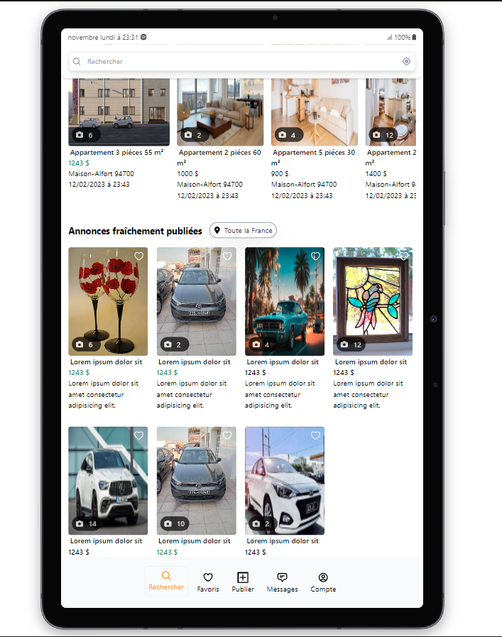

<h2 align="center">
 TUNALGO
<br/>

</h2>

<h3 align="center">
 Vue Desktop
<br/>

</h3>
<div align="center" style="display: flex; justify-content: center;flex-direction: row; align-items: center; margin-top: 10px;">
  
  
</div>
<h3 align="center">
 Vue Tablette
<br/>

</h3>
<div align="center" style="display: flex; justify-content: center; align-items: center; margin-top: 10px;">
  
  
</div>
<h3 align="center">
 Vue Mobile
<br/>

</h3>
<div align="center" style="display: flex; justify-content: center; align-items: center; margin-top: 10px;">
  
  
</div>

# Mon Projet Tailwind CSS


Bienvenue dans mon projet utilisant Tailwind CSS! Ce framework CSS puissant permet de créer des interfaces utilisateur modernes et réactives avec une approche utility-first.

## Installation

Pour commencer, assurez-vous d'installer Tailwind CSS via npm. Exécutez la commande suivante dans votre terminal :

```bash
npm install -D tailwindcss postcss autoprefixer
npx tailwindcss init

```

## Utilisation
Une fois Tailwind CSS installé, vous pouvez personnaliser votre propre feuille de style en utilisant la commande suivante :
```bash
npx tailwindcss -i ./style.css -o ./dist/output.css --watch
```
